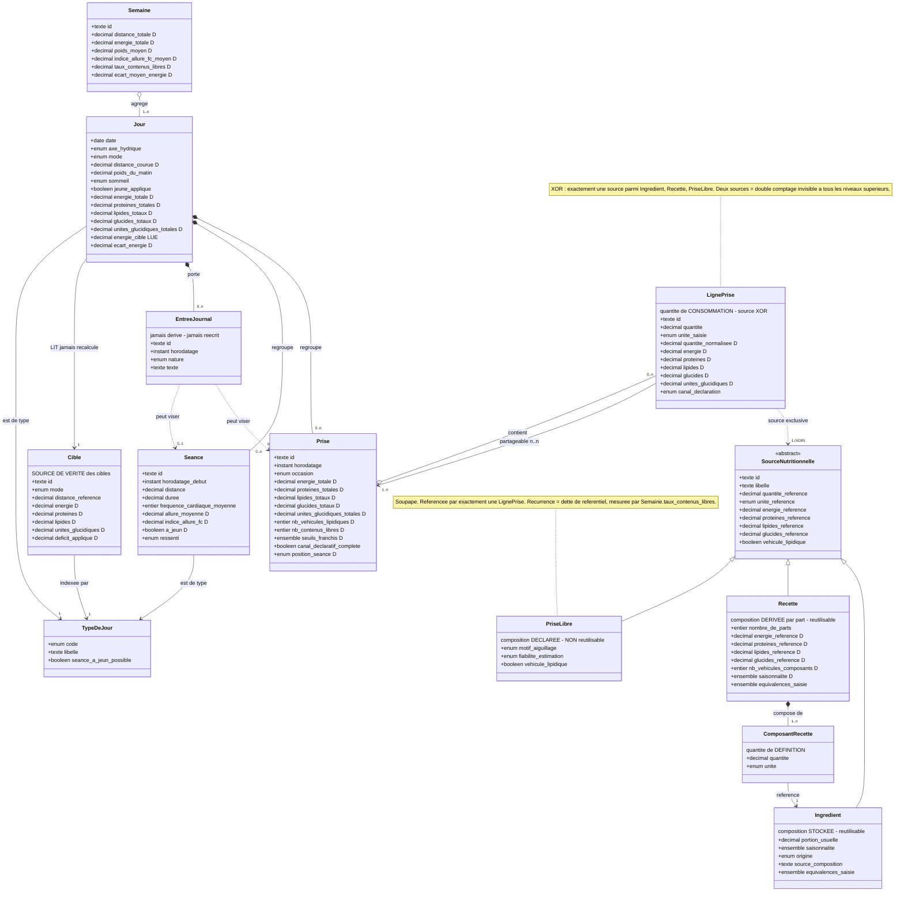

# Modèle de domaine

> Description portable du système. Rien dans ce document ne dépend d'un support
> de stockage particulier. Les paramètres numériques sont nommés ici et définis
> dans [`config/parametres-defaut.yaml`](../config/parametres-defaut.yaml).
> La traduction vers les bases Notion est dans [`adaptateur-notion.md`](./adaptateur-notion.md).

**Règle absolue de ce document : aucune valeur numérique.** Un seuil, un coefficient
ou une calibration qui apparaîtrait ici créerait une deuxième source de vérité,
qui divergerait de `parametres-defaut.yaml` sans que rien ne le signale. Les
paramètres sont désignés par leur clé de configuration, jamais par leur valeur.

---

## 1. Objet du système

Le système ne compte pas les calories. Il rend **observables les modes de
défaillance** d'une alimentation réelle, pour que la correction devienne un
réflexe plutôt qu'une décision.

Un mode de défaillance est un écart récurrent, structurel, invisible à
l'introspection. Exemples caractéristiques : lipides invisibles apportés par des
véhicules liquides, doses protéiques systématiquement sous le seuil de synthèse,
créneau de collation systématiquement sauté entraînant une compensation tardive.

Le système est donc d'abord un **instrument de détection**, ensuite un instrument
de pilotage.

## 2. Conventions de notation

### 2.1 Nommage

`snake_case`, sans accent, en français. Le nom d'un attribut dérivé porte la
grandeur, jamais le mode de calcul : `energie_totale`, pas `somme_energie`. Le
mode de calcul change ; la grandeur, non.

### 2.2 Nature d'un attribut

| Code | Nature | Règle d'écriture |
| ---- | ------ | ---------------- |
| **S** | Stocké | Saisi ou déclaré. Seule source de vérité de sa valeur. |
| **D** | Dérivé | Calculé à partir d'attributs du même niveau ou du niveau inférieur. **Jamais saisi**, jamais corrigé directement. |
| **R** | Référence | Pointeur vers une autre entité. Ne recopie aucune valeur de la cible. |

Un attribut **D** corrigé à la main est le principal générateur de divergence
silencieuse : la valeur affichée devient juste, la source reste fausse, et
l'erreur ressort au recalcul suivant.

### 2.3 Types logiques

`texte`, `entier`, `decimal`, `booleen`, `instant`, `date`, `enum(…)`,
`ensemble(…)`, `ref(Entité)`. Aucun type propriétaire.

### 2.4 Cardinalité

`1..1` obligatoire unique · `0..1` facultatif unique · `1..n` obligatoire
multiple · `0..n` facultatif multiple.

### 2.5 Deux natures de quantité

Le modèle distingue deux quantités qui ne se confondent jamais :

| Nature | Portée | Porteur | Datée |
| ------ | ------ | ------- | ----- |
| **Quantité de définition** | référentielle — « ce que contient une recette » | `ComposantRecette` | non |
| **Quantité de consommation** | événementielle — « ce qui a été mangé » | `LignePrise` | oui |

Les confondre revient à modifier une recette en corrigeant un repas, ou
l'inverse. Aucune autre entité que ces deux-là ne porte de quantité.

---

## 3. Les trois canaux de contenu

C'est le point d'entrée du modèle, et la distinction la plus souvent mal comprise.
Une prise est composée de contenus, et un contenu provient de **l'un des trois
canaux, et d'un seul**.

| | `Ingredient` | `Recette` | `PriseLibre` |
| --- | --- | --- | --- |
| **Nature** | Définition atomique | Définition composée | Consommation ponctuelle |
| **Réutilisable** | Oui, indéfiniment | Oui, indéfiniment | **Non** |
| **Composition** | **Stockée**, pour une quantité de référence | **Dérivée** des composants ÷ parts | **Stockée en propre**, déclarée à la volée |
| **Décomposable** | Non — c'est le grain le plus fin | Oui, en `ComposantRecette` | Non — opaque par construction |
| **Durée de vie** | Permanente | Permanente | Celle de la prise qui la porte |
| **Effet d'une correction** | Rétroactif sur tout l'historique | Rétroactif sur tout l'historique | **Local, sur une seule prise** |
| **Rôle** | Socle du référentiel | Facteur de saisie | **Soupape** |

### 3.1 Le critère de choix du canal

Une seule question, dans cet ordre :

1. Cet aliment existe-t-il au référentiel ? → `Ingredient`.
2. Cette préparation a-t-elle une composition connue et sera-t-elle refaite ? → `Recette`.
3. Sinon → `PriseLibre`, **avec motif d'aiguillage obligatoire**.

### 3.2 Pourquoi `Recette` n'est pas un raccourci de saisie

Une recette n'existe pas pour aller plus vite. Elle existe parce qu'un plat
mélangé **n'est pas décomposable à l'observation** : une unité manuelle appliquée
à un plat mixte mesure le volume total du mélange, pas ses composants. Décomposer
un plat mixte en unités par ingrédient au moment du repas produit des valeurs
fictives. La décomposition doit avoir lieu **une fois, à la définition**, quand
les quantités sont réellement connues — c'est-à-dire en cuisinant.

### 3.3 Pourquoi `PriseLibre` est une soupape et non un troisième référentiel

Sans elle, une consommation non catalogable — repas au restaurant, plat d'un
tiers, produit industriel non répertorié — force un arbitrage entre deux mauvaises
options : ne pas saisir (trou dans l'observation, indétectable), ou inventer un
ingrédient bidon (pollution durable du référentiel). La `PriseLibre` absorbe le
cas sans contaminer le référentiel.

**Contrepartie : sa fréquence est elle-même un signal.** Un `motif_aiguillage`
qui revient est une dette de référentiel, pas une fatalité. Le mode de
défaillance associé — la dérive du référentiel — se manifeste ainsi : le
référentiel cesse de s'enrichir, tout passe par la soupape, et la composition
redevient de l'estimation à chaque repas.

**Règle de promotion.** Un contenu saisi en `PriseLibre` au-delà de
`referentiel.seuil_promotion` occurrences doit être promu en `Ingredient` ou
`Recette`. La promotion est un ajout ; **elle ne réécrit pas l'historique**, sous
peine de rendre les jours passés non reproductibles.

### 3.4 Contrainte d'exclusivité

Une `LignePrise` référence **exactement une** source, parmi les trois. Zéro
référence est une ligne vide ; deux références est une double comptabilisation
qui ne se détecte à **aucun** niveau supérieur — les totaux restent plausibles.

---

## 4. Entités et attributs

### 4.1 `SourceNutritionnelle` — abstraite

Contrat commun aux trois canaux. N'est jamais instanciée. Toute entité pouvant
être référencée par une `LignePrise` l'implémente.

| Attribut | Type | Unité | Card. | Nature | Règle |
| -------- | ---- | ----- | ----- | ------ | ----- |
| `id` | texte | — | 1..1 | S | Identité stable, jamais réattribuée. |
| `libelle` | texte | — | 1..1 | S | — |
| `quantite_reference` | decimal | `unite_reference` | 1..1 | S ou D | Quantité à laquelle s'entend toute la composition. |
| `unite_reference` | enum(g, ml, part) | — | 1..1 | S | — |
| `energie_reference` | decimal | kcal | 1..1 | S ou D | Selon le canal, cf. §3. |
| `proteines_reference` | decimal | g | 1..1 | S ou D | — |
| `lipides_reference` | decimal | g | 1..1 | S ou D | — |
| `glucides_reference` | decimal | g | 1..1 | S ou D | — |
| `vehicule_lipidique` | booleen | — | 1..1 | D si portion connue, S sinon | Vrai si les lipides ramenés à la portion atteignent `lipides.seuil_vehicule`. **Statut structurel, indépendant de la quantité consommée.** |

### 4.2 `Ingredient`

Référentiel atomique. Un ingrédient est une **définition**, pas une consommation.
Il n'est jamais dupliqué par consommation : un même ingrédient consommé deux fois
reste un seul enregistrement.

*Implémente `SourceNutritionnelle`. Composition **stockée**.*

| Attribut | Type | Unité | Card. | Nature | Règle |
| -------- | ---- | ----- | ----- | ------ | ----- |
| `portion_usuelle` | decimal | g | 0..1 | S | Masse d'une portion réelle. Nécessaire pour dériver `vehicule_lipidique`. |
| `saisonnalite` | ensemble(mois) ∪ {toute_annee} | — | 0..n | S | — |
| `origine` | enum(France, UE, hors_UE, indeterminee) | — | 0..1 | S | — |
| `source_composition` | texte | — | 0..1 | S | Traçabilité de la donnée nutritionnelle (référentiel externe, code produit). |
| `equivalences_saisie` | ensemble(unite_saisie → decimal g) | — | 0..n | S | Conversion propre à l'ingrédient, cf. §8. |

**Invariant.** Un `Ingredient` ne porte **aucune quantité consommée**. S'il en
porte une, c'est une `LignePrise` déguisée.

### 4.3 `ComposantRecette`

Jonction de **définition**. Relie un `Ingredient` à une `Recette` et porte la
quantité de définition (§2.5).

| Attribut | Type | Unité | Card. | Nature | Règle |
| -------- | ---- | ----- | ----- | ------ | ----- |
| `recette` | ref(Recette) | — | 1..1 | R | — |
| `ingredient` | ref(Ingredient) | — | 1..1 | R | **Un composant est toujours un ingrédient.** Cf. invariant ci-dessous. |
| `quantite` | decimal | `unite` | 1..1 | S | Pour la recette **entière**, pas par part. |
| `unite` | enum(g, ml) | — | 1..1 | S | Unités manuelles interdites ici : une définition doit être reproductible. |

**Invariant de non-imbrication.** Une `Recette` ne peut pas être composant d'une
autre `Recette`. L'imbrication rendrait la dérivation récursive, la profondeur non
bornée et les cycles indétectables. Une préparation utilisée dans une autre se
saisit à plat.

### 4.4 `Recette`

Préparation composée, réutilisable. **Sa composition n'est jamais saisie : elle
est dérivée.** Une composition de recette saisie à la main diverge de ses
composants dès la première correction d'ingrédient.

*Implémente `SourceNutritionnelle`. Composition **dérivée**, `unite_reference = part`.*

| Attribut | Type | Unité | Card. | Nature | Règle |
| -------- | ---- | ----- | ----- | ------ | ----- |
| `composants` | ref(ComposantRecette) | — | 1..n | R | — |
| `nombre_de_parts` | entier | — | 1..1 | S | **La division se fait à la définition, pas à la lecture.** Cf. décision ci-dessous. |
| `energie_reference` … `glucides_reference` | decimal | kcal, g | 1..1 | **D** | Σ des composants ÷ `nombre_de_parts`. Exprimée **par part**. |
| `vehicule_lipidique` | booleen | — | 1..1 | D | Vrai si la recette **elle-même**, par part, atteint `lipides.seuil_vehicule`. |
| `nb_vehicules_composants` | entier | — | 1..1 | D | Nombre de composants eux-mêmes véhicules. **Diagnostic de conception de la recette**, pas contrainte : une recette n'est jamais rejetée. |
| `saisonnalite` | ensemble(mois) | — | 0..n | D | Intersection des saisonnalités des composants. |
| `equivalences_saisie` | ensemble(unite_saisie → decimal g) | — | 0..n | S | — |

**Décision tranchée : la division par parts se fait à la définition.** La
`Recette` expose une composition **par part**, et la `LignePrise` porte un nombre
de parts consommées. L'alternative — exposer la composition totale et diviser à
la lecture — répartit la division sur tous les points de lecture ; il suffit d'un
point qui l'oublie pour produire une erreur d'un facteur `nombre_de_parts`,
c'est-à-dire une erreur énorme et parfaitement plausible à l'affichage.

**Conséquence à assumer.** Modifier `nombre_de_parts` ou un composant modifie
rétroactivement tous les repas passés qui référencent la recette. C'est le prix de
la non-duplication. Un repas qui doit rester figé relève de la `PriseLibre`.

### 4.5 `PriseLibre`

Consommation ponctuelle dont la composition est déclarée à la volée. **Ce n'est
pas un référentiel** : elle n'a pas d'existence hors de la prise qui la porte.

*Implémente `SourceNutritionnelle`. Composition **stockée en propre**.*

| Attribut | Type | Unité | Card. | Nature | Règle |
| -------- | ---- | ----- | ----- | ------ | ----- |
| `motif_aiguillage` | enum(hors_domicile, produit_non_catalogue, preparation_ponctuelle, estimation_grossiere, urgence_de_saisie) | — | 1..1 | S | **Obligatoire.** Contre-mesure de la dérive du référentiel. |
| `fiabilite_estimation` | enum(mesuree, estimee, approximative) | — | 1..1 | S | Une composition déclarée n'a pas le statut épistémique d'une composition référencée. Le modèle refuse de faire semblant. |
| `vehicule_lipidique` | booleen | — | 1..1 | S | **Déclaré**, non dérivable : aucune portion de référence stable. |

**Invariant.** Une `PriseLibre` est référencée par **exactement une** `LignePrise`.
Toute réutilisation est un abus : elle signale une entité qui aurait dû être un
`Ingredient` ou une `Recette`.

### 4.6 `LignePrise`

Jonction de **consommation**. Porte la quantité consommée et le canal de capture.

| Attribut | Type | Unité | Card. | Nature | Règle |
| -------- | ---- | ----- | ----- | ------ | ----- |
| `id` | texte | — | 1..1 | S | — |
| `ingredient` | ref(Ingredient) | — | 0..1 | R | **Exclusif** — cf. §3.4. |
| `recette` | ref(Recette) | — | 0..1 | R | **Exclusif.** |
| `prise_libre` | ref(PriseLibre) | — | 0..1 | R | **Exclusif.** |
| `prises` | ref(Prise) | — | 1..n | R | **n..n intentionnel**, cf. §4.7. |
| `quantite` | decimal | `unite_saisie` | 1..1 | S | Quantité **consommée**. |
| `unite_saisie` | enum(…) | — | 1..1 | S | Voir §8. Pour une `Recette`, l'unité est `part`. |
| `quantite_normalisee` | decimal | g ou part | 1..1 | D | `quantite` × facteur de conversion de la source. Une source sans conversion connue interdit la saisie en unité manuelle. |
| `energie` … `glucides` | decimal | kcal, g | 1..1 | D | composition de la source × `quantite_normalisee` ÷ `quantite_reference`. |
| `unites_glucidiques` | decimal | UG | 1..1 | D | `glucides` ÷ `glucides.grammes_par_ug`. |
| `canal_declaration` | enum(photo, verbal, mixte) | — | 1..1 | S | Trace de **comment** la ligne a été capturée. Voir §9. |

**Invariant de capture.** Toute ligne dont la source est un véhicule lipidique
liquide (huile, sauce, assaisonnement) exige `canal_declaration ∈ {verbal, mixte}`.
Le canal photo ne peut pas capturer un lipide liquide : une ligne de ce type
marquée `photo` est une valeur inventée.

### 4.7 `Prise`

Événement de consommation situé dans le temps.

| Attribut | Type | Unité | Card. | Nature | Règle |
| -------- | ---- | ----- | ----- | ------ | ----- |
| `id` | texte | — | 1..1 | S | — |
| `horodatage` | instant | — | 1..1 | S | Clé de tri et d'appartenance au jour. |
| `libelle` | texte | — | 0..1 | S | — |
| `occasion` | enum(…) | — | 1..1 | S | Voir §8. Détermine les règles applicables. |
| `jour` | ref(Jour) | — | 1..1 | R | Dérivable de `horodatage`, mais **stockée** : le rattachement doit rester corrigeable sans toucher à l'heure. |
| `lignes` | ref(LignePrise) | — | 0..n | R | — |
| `energie_totale` … `unites_glucidiques_totales` | decimal | kcal, g, UG | 1..1 | D | Σ des lignes. |
| `nb_vehicules_lipidiques` | entier | — | 1..1 | D | Nombre de lignes dont la source est véhicule. **Compte de slots, pas une masse.** |
| `nb_contenus_libres` | entier | — | 1..1 | D | Indicateur de qualité d'observation de la prise. |
| `seuils_franchis` | ensemble(seuil) | — | 0..n | D | Voir §7. |
| `canal_declaratif_complete` | booleen | — | 1..1 | S | Une prise sans déclaration verbale est **incomplète par construction**, même intégralement photographiée. |
| `position_seance` | enum(avant, apres, hors) | — | 1..1 | D | Position relative à la `Seance` du jour, par comparaison des horodatages. Conditionne les règles de placement glucidique. |

**Invariant de partage.** Une `LignePrise` peut être rattachée à **plusieurs**
`Prise`. Ce n'est pas une anomalie d'intégrité. Le cas se produit légitimement
lorsqu'une même préparation est consommée sur deux occasions distinctes, ou
qu'elle chevauche deux jours. Toute implémentation doit l'autoriser et **aucun
contrôle de cohérence ne doit le signaler comme erreur**.

**Invariant d'unicité du véhicule.** `nb_vehicules_lipidiques` et
`lipides_totaux` sont **deux contraintes distinctes**. La première est
structurelle (combien de slots gras occupés), la seconde quantitative (combien de
grammes). Une prise peut respecter le plafond et violer l'unicité du véhicule.
Confondre les deux fait disparaître le mode de défaillance le plus fréquent :
l'empilement de sources grasses individuellement modestes.

### 4.8 `Seance`

Séance d'entraînement. Porte les signaux de pilotage physiologique.

| Attribut | Type | Unité | Card. | Nature | Règle |
| -------- | ---- | ----- | ----- | ------ | ----- |
| `id` | texte | — | 1..1 | S | — |
| `jour` | ref(Jour) | — | 1..1 | R | — |
| `horodatage_debut` | instant | — | 1..1 | S | Détermine `Prise.position_seance`. |
| `type_seance` | ref(TypeDeJour) | — | 1..1 | R | Footing, qualité, sortie longue. |
| `distance` | decimal | km | 1..1 | S | — |
| `duree` | decimal | min | 1..1 | S | — |
| `frequence_cardiaque_moyenne` | entier | bpm | 0..1 | S | **Sans elle, le signal d'arrêt n°2 du déficit — dégradation d'allure à fréquence cardiaque égale — n'est pas calculable.** |
| `allure_moyenne` | decimal | min/km | 1..1 | D | `duree` ÷ `distance`. |
| `indice_allure_fc` | decimal | — | 0..1 | D | `allure_moyenne` rapportée à `frequence_cardiaque_moyenne`. Interprétable **en tendance seulement**, jamais sur une séance isolée. |
| `a_jeun` | booleen | — | 1..1 | D | Vrai si aucune `Prise` du jour ne précède `horodatage_debut`. |
| `ressenti` | enum(facile, nominal, difficile, abandon) | — | 0..1 | S | Seul attribut subjectif du niveau. Corrèle avec la charge glucidique du dîner de la veille. |

**Invariant de fenêtre.** La charge glucidique déterminante d'une séance à jeun
est celle du **dîner de la veille**, pas du petit-déjeuner. Toute analyse d'une
`Seance` où `a_jeun = vrai` doit lire les prises du jour précédent. C'est la
seule règle du modèle qui franchit la frontière du `Jour`.

### 4.9 `Jour`

Unité de bilan.

| Attribut | Type | Unité | Card. | Nature | Règle |
| -------- | ---- | ----- | ----- | ------ | ----- |
| `date` | date | — | 1..1 | S | Clé naturelle. Unique. |
| `type_de_jour` | ref(TypeDeJour) | — | 1..1 | R | Axe **charge**. |
| `axe_hydrique` | enum(diluer, neutre, concentrer) | — | 0..1 | S | Axe **eau**, orthogonal au précédent. Deux axes, deux attributs, jamais fusionnés. |
| `mode` | enum(deficit, maintien) | — | 1..1 | S | Le mode se change **ici et nulle part ailleurs**. |
| `seances` | ref(Seance) | — | 0..n | R | — |
| `distance_courue` | decimal | km | 1..1 | **D** | Σ des séances. **Devient dérivée** avec l'intégration de `Seance` — cf. §11, écart n°6. |
| `poids_du_matin` | decimal | kg | 0..1 | S | Signal d'arrêt n°1 du déficit. |
| `sommeil` | enum(bon, moyen, mauvais) | — | 0..1 | S | Signal d'arrêt n°3. |
| `jeune_applique` | booleen | — | 1..1 | S | Faux si le dîner de la veille était insuffisamment chargé pour une séance à jeun. Décision **prise la veille au soir**. |
| `cible` | ref(Cible) | — | 1..1 | R | Voir §4.11. |
| `semaine` | ref(Semaine) | — | 1..1 | R | — |
| `prises` | ref(Prise) | — | 0..n | R | — |
| `entrees_journal` | ref(EntreeJournal) | — | 0..n | R | — |
| `energie_totale` … `unites_glucidiques_totales` | decimal | kcal, g, UG | 1..1 | D | Σ des prises. **Jamais reconstruites de mémoire.** |
| `energie_cible` … `unites_glucidiques_cible` | decimal | kcal, g, UG | 1..1 | **D par lecture** | Lues dans `cible`. Aucun recalcul local. |
| `ecart_energie` … `ecart_unites_glucidiques` | decimal | % | 1..1 | D | **Signé.** Un écart non signé masque la direction de la dérive, qui est l'information utile. |

### 4.10 `Semaine`

Unité de décision. Le jour est bruité ; la semaine est la plus petite maille sur
laquelle un arbitrage a du sens.

| Attribut | Type | Unité | Card. | Nature | Règle |
| -------- | ---- | ----- | ----- | ------ | ----- |
| `id` | texte | — | 1..1 | S | Année-semaine ISO. |
| `jours` | ref(Jour) | — | 1..n | R | — |
| `distance_totale` | decimal | km | 1..1 | D | Σ des jours. |
| `energie_totale` … `unites_glucidiques_totales` | decimal | kcal, g, UG | 1..1 | D | Σ des jours. |
| `poids_moyen` | decimal | kg | 0..1 | D | **Moyenne, pas somme.** Seule série de poids exploitable ; la mesure quotidienne est du bruit. |
| `indice_allure_fc_moyen` | decimal | — | 0..1 | D | Moyenne sur les séances comparables. Maille minimale d'interprétation. |
| `taux_contenus_libres` | decimal | % | 1..1 | D | Part des lignes issues de `PriseLibre`. **Mesure de la dérive du référentiel.** |
| `ecart_moyen_*` | decimal | % | 1..1 | D | Moyenne des écarts signés. |

**Règle de pilotage.** Aucun arbitrage sur moins de `pilotage.fenetre_tendance`
semaines de tendance. Réagir à une semaine isolée, c'est piloter le bruit.

### 4.11 `Cible`

Jeu de valeurs cibles généré pour une combinaison de conditions. **Source de
vérité unique** des cibles.

| Attribut | Type | Unité | Card. | Nature | Règle |
| -------- | ---- | ----- | ----- | ------ | ----- |
| `id` | texte | — | 1..1 | S | — |
| `type_de_jour` | ref(TypeDeJour) | — | 1..1 | R | Clé de recherche. |
| `mode` | enum(deficit, maintien) | — | 1..1 | S | Clé de recherche. |
| `distance_reference` | decimal | km | 1..1 | S | Clé de recherche. |
| `energie` | decimal | kcal | 1..1 | D | `energie.base` + `energie.coefficient_par_km` × `distance_reference`, minoré du déficit si `mode = deficit`. |
| `proteines` | decimal | g | 1..1 | D | `proteines.cible_journaliere`. |
| `lipides` | decimal | g | 1..1 | D | `lipides.plafond_journalier`. |
| `unites_glucidiques` | decimal | UG | 1..1 | D | Résidu : ce que l'énergie laisse une fois protéines et lipides posés. |
| `deficit_applique` | decimal | kcal | 1..1 | D | Explicite, pour être auditable. |

**Invariant du chemin unique.** Génératif décrit le **mode de détermination**
d'une cible ; il ne décrit pas son **mode d'accès**. Une cible est **générée une
fois ici**, et **lue partout ailleurs**. Une formule qui recalcule une cible
depuis `Jour` en recodant les coefficients crée un second chemin : les deux
divergent au premier changement de paramètre, et rien ne le signale.

### 4.12 `TypeDeJour`

| Attribut | Type | Card. | Nature | Règle |
| -------- | ---- | ----- | ------ | ----- |
| `code` | enum(repos, footing, qualite, sortie_longue) | 1..1 | S | — |
| `libelle` | texte | 1..1 | S | — |
| `seance_a_jeun_possible` | booleen | 1..1 | S | Conditionne la charge glucidique du dîner de la veille. |

### 4.13 `EntreeJournal`

Narratif : contexte, ressenti, événement de vie, écart assumé.

| Attribut | Type | Card. | Nature | Règle |
| -------- | ---- | ----- | ------ | ----- |
| `id` | texte | 1..1 | S | — |
| `jour` | ref(Jour) | 1..1 | R | — |
| `prise` | ref(Prise) | 0..1 | R | Renseignée si l'entrée porte sur une prise précise. |
| `seance` | ref(Seance) | 0..1 | R | Renseignée si l'entrée porte sur une séance précise. |
| `horodatage` | instant | 1..1 | S | — |
| `nature` | enum(contexte, ressenti, evenement_de_vie, ecart_assume, ajustement) | 1..1 | S | — |
| `texte` | texte | 1..1 | S | **Libre. Non structuré. Jamais normalisé.** |

**Invariant d'analyse.** Le journal n'est pas un accessoire. Les valeurs
chiffrées disent *quoi*, le journal dit *pourquoi*. **Toute analyse du système
doit s'appuyer sur les entrées du journal** ; une analyse purement quantitative
produit des recommandations inapplicables au contexte réel. Aucun attribut
d'`EntreeJournal` n'est dérivé, et aucun processus automatique ne réécrit son
texte.

---

## 5. Cardinalités

| Relation | Cardinalité | Commentaire |
| -------- | ----------- | ----------- |
| `Ingredient` → `ComposantRecette` | `1..n` | Composition jamais recopiée. |
| `ComposantRecette` → `Recette` | `n..1` | Quantité de **définition**. |
| `Ingredient` → `LignePrise` | `1..n` | Canal 1. |
| `Recette` → `LignePrise` | `1..n` | Canal 2. |
| `PriseLibre` → `LignePrise` | **`1..1`** | Canal 3 — non réutilisable. |
| `LignePrise` → source | **`XOR`** | Exactement une des trois, cf. §3.4. |
| `LignePrise` → `Prise` | **`n..n`** | Multiplicité **intentionnelle**, cf. §4.7. |
| `Prise` → `Jour` | `n..1` | — |
| `Seance` → `Jour` | `n..1` | — |
| `Jour` → `Cible` | `n..1` | **Lecture seule.** |
| `Jour` → `TypeDeJour` | `n..1` | — |
| `Jour` → `Semaine` | `n..1` | — |
| `Jour` → `EntreeJournal` | `1..n` | — |

---

## 6. Cibles

Les cibles sont **génératives** : calculées par formule à partir de la charge du
jour. Aucune table de correspondance jour-par-jour.

| Cible | Détermination | Clés de configuration |
| ----- | ------------- | --------------------- |
| Énergie | base + coefficient × distance courue, minorée du déficit | `energie.base`, `energie.coefficient_par_km`, `energie.deficit` |
| Protéines | plage journalière fixe | `proteines.cible_journaliere` |
| Lipides | plafond journalier fixe | `lipides.plafond_journalier` |
| Glucides | résidu de l'énergie une fois protéines et lipides posés | `glucides.*` |

**Un input (km), deux constantes (protéines, lipides), un résidu (glucides).**
Les glucides ne sont jamais choisis : ils tombent.

L'écart à la cible est exprimé **signé et en pourcentage**, par macronutriment.

---

## 7. Seuils

Les seuils s'évaluent **par prise**, pas par jour. C'est le point structurant :
un total journalier conforme peut masquer une répartition inopérante.

| Seuil | Nature | Portée | Clé |
| ----- | ------ | ------ | --- |
| Synthèse protéique | plancher — en deçà, l'apport ne déclenche pas la synthèse | quantitative | `proteines.seuil_synthese_par_prise` |
| Plafond lipidique | plafond de masse | quantitative | `lipides.plafond_par_prise` |
| Véhicule lipidique | qualifie une source comme porteuse de gras | structurelle | `lipides.seuil_vehicule` |
| Unicité du véhicule | un seul véhicule autorisé par prise | structurelle | `lipides.vehicules_max_par_prise` |
| Promotion au référentiel | au-delà, une `PriseLibre` récurrente doit être promue | gouvernance | `referentiel.seuil_promotion` |

Un franchissement de seuil est **signalé, pas bloqué**. Le système décrit le
réel ; il ne le contraint pas.

---

## 8. Énumérations

Les valeurs ci-dessous sont les **domaines** des attributs énumérés. Leurs
calibrations chiffrées (équivalences en grammes, conversions en UG) sont dans
`protocole-saisie.md` et `parametres-defaut.yaml` — jamais ici.

| Énumération | Domaine |
| ----------- | ------- |
| `unite_saisie` | `main_creuse` (féculent) · `paume` (source protéique) · `poing` (légume) · `pouce` (matière grasse ajoutée) · `gramme` · `millilitre` · `part` |
| `occasion` | `petit_dejeuner` · `dejeuner` · `collation` · `diner` · `ravitaillement` |
| `type_de_jour` | `repos` · `footing` · `qualite` · `sortie_longue` |
| `axe_hydrique` | `diluer` · `neutre` · `concentrer` |
| `mode` | `deficit` · `maintien` |
| `sommeil` | `bon` · `moyen` · `mauvais` |
| `origine` | `France` · `UE` · `hors_UE` · `indeterminee` |
| `canal_declaration` | `photo` · `verbal` · `mixte` |
| `position_seance` | `avant` · `apres` · `hors` |
| `ressenti` | `facile` · `nominal` · `difficile` · `abandon` |
| `motif_aiguillage` | `hors_domicile` · `produit_non_catalogue` · `preparation_ponctuelle` · `estimation_grossiere` · `urgence_de_saisie` |
| `fiabilite_estimation` | `mesuree` · `estimee` · `approximative` |

**Note de calibration.** Une unité manuelle n'a pas de valeur universelle : une
main creuse de riz et une main creuse de légumineuses ne portent pas la même
charge glucidique. La conversion est donc portée par `equivalences_saisie`, au
niveau de la source, jamais par un facteur global.

**Note de mesure.** Une unité manuelle appliquée à un plat mélangé mesure le
**volume total du mélange**, pas ses composants. Un plat mélangé relève donc de
`Recette` (`unite_saisie = part`) ou de `PriseLibre` — jamais d'une somme
d'`Ingredient` estimés au moment du repas.

---

## 9. Chaîne de calcul

Le calcul est **ascendant et strictement ordonné**. Chaque niveau agrège le
niveau inférieur ; aucun niveau ne recalcule ce qu'un autre a déjà agrégé.

```
                 ┌─ ComposantRecette  composition(Ingredient) × quantité de définition
                 │        ↓  Σ ÷ nombre_de_parts
                 └─ Recette           composition PAR PART
                          ↘
Ingredient ────────────────→ LignePrise   composition(source) × quantité normalisée
PriseLibre ────────────────↗      ↓  Σ
                            Prise         totaux + franchissements de seuils par prise
                                  ↓  Σ
Seance ─────────────────────→ Jour        totaux + cibles LUES + écart signé
                                  ↓  Σ / moyenne
                            Semaine       totaux, poids moyen, indice allure/FC, tendance
```

**Règle de lecture.** Les totaux d'un niveau se lisent dans l'agrégat de ce
niveau. Jamais par addition manuelle des éléments connus : les éléments non
interrogés seraient silencieusement omis, et l'erreur serait indétectable.

**Règle de correction.** Corriger dans l'ordre : composant, puis recette, puis
ligne, puis prise, puis jour, puis semaine. Corriger un total sans corriger sa
source crée une divergence qui ne se signale pas.

**Règle de double canal.** La capture repose sur deux canaux non substituables :
le canal visuel capture les solides et sous-estime structurellement les volumes ;
le canal déclaratif est le seul à pouvoir capturer les matières grasses liquides
et les quantités de féculents. **Ni l'un ni l'autre n'est suffisant seul.** Une
prise dont `canal_declaratif_complete` est faux ne doit pas être traitée comme
une observation, mais comme une observation partielle.

---

## 10. Principes de conception

- **Génératif plutôt que tabulaire.** Une formule paramétrée plutôt qu'une table
  de correspondance. Une table se périme et diverge ; une formule se corrige en
  un point.
- **Un chemin, un seul.** Toute grandeur a exactement un lieu de calcul et un
  nombre quelconque de lieux de lecture.
- **Trois canaux, un seul par contenu.** L'exclusivité n'est pas une commodité
  d'implémentation : deux sources sur une même ligne produisent une double
  comptabilisation invisible à tous les niveaux supérieurs.
- **Décomposer à la définition, jamais à l'observation.** Un plat mélangé se
  décompose en cuisinant, pas en le regardant.
- **La soupape doit rester une soupape.** `PriseLibre` absorbe l'imprévu sans
  polluer le référentiel — à condition que sa récurrence soit mesurée.
- **Minimalisme de schéma.** Ne conserver que ce qui n'est pas dérivable.
- **Explicite plutôt qu'inféré.** Ce qu'un canal de saisie ne peut pas capturer
  doit être déclaré. Ne jamais supposer.
- **Structurel et quantitatif sont deux contraintes.** Un compte de slots et une
  masse ne se remplacent pas.
- **Les glucides se placent, ils ne se réduisent pas.** Le levier du déficit est
  lipidique ; la quantité de glucides suit la charge, seule leur répartition
  temporelle est un paramètre de pilotage.
- **Le dîner alimente le lendemain matin.** Pour une séance à jeun, la décision
  nutritionnelle déterminante est prise la veille au soir, pas le matin même.

---

## 11. Écarts connus entre ce modèle et l'instance de référence

Section vivante. Un écart non documenté devient une règle tacite.

| # | Écart | Statut |
| - | ----- | ------ |
| 1 | La cible est recalculée localement au niveau `Jour` en plus d'être lue dans `Cible`. Deux chemins coexistent (§4.11). | Ouvert — le seul écart réellement coûteux. |
| 2 | Les seuils sont codés en dur dans la formule d'évaluation au lieu d'être lus depuis leur définition (§7). | Ouvert. |
| 3 | `vehicule_lipidique` n'est pas renseigné sur l'ensemble du référentiel. Tant qu'il est incomplet, `nb_vehicules_lipidiques` sous-compte **sans le signaler**. | Ouvert — backfill. |
| 4 | `mode`, `cible`, `axe_hydrique` non renseignés sur les jours antérieurs à leur création. | Ouvert — backfill ou application aux jours à venir seulement. |
| 5 | L'exclusivité des trois canaux (§3.4) n'est pas contrainte techniquement : rien n'empêche une ligne de référencer deux sources. | Ouvert — contrôle à ajouter. |
| 6 | `Jour.distance_courue` est saisie alors que le modèle la rend dérivée de `Seance`. Tant que `Seance` n'est pas peuplée, elle doit **rester saisie**. Bascule en une fois, jamais en double. | Ouvert. |
| 7 | `Recette` porte une composition saisie au lieu d'être dérivée de `ComposantRecette` (§4.4). Tant que c'est le cas, une correction d'ingrédient ne se propage pas. | Ouvert. |
| 8 | `ComposantRecette` n'existe pas en tant que jonction : les quantités de définition sont portées directement par la recette. | Ouvert. |
| 9 | `frequence_cardiaque_moyenne` sans historique : le signal d'arrêt n°2 reste indisponible tant que `pilotage.fenetre_tendance` semaines ne sont pas accumulées. | Délai, pas défaut. |

---

## 12. Hors périmètre

Ce système est un instrument d'observation personnel. Il ne produit pas de
diagnostic et ne remplace pas un suivi médical ou diététique. Les paramètres par
défaut décrivent une configuration individuelle documentée, non une
recommandation généralisable : toute nouvelle instance doit les redéfinir avec
un professionnel de santé, en particulier en cas de pathologie, de grossesse,
d'antécédent de trouble du comportement alimentaire, ou pour un mineur.

---

## 13. Diagramme de classes



**Légende.** Le suffixe `D` marque un attribut **dérivé**, `LUE` un attribut lu
dans une autre entité sans recalcul. `*--` composition (le tout détruit la
partie) · `o--` agrégation (la partie survit au tout) · `..>` dépendance ou
référence facultative · `<|--` héritage.
